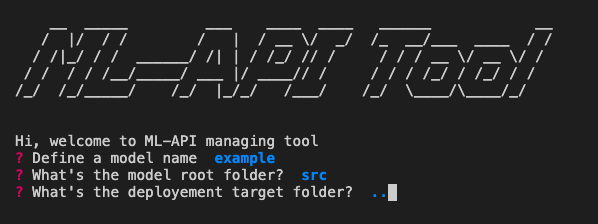
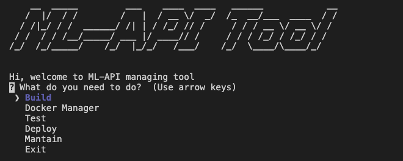

# ML API Tool

Simple Tool to wrap models into ml API, test them locally and deploying on AWS as endpoints.

## Requirements

 - Python 3.6 or higher
 - Docker
 - AWS cli (to allow functionalities in deployement menu)

## Setup

Download the repo from this page, place it in the desired installation path excluding the "Example" folder that we will be using later on.
Then navigate into that folder.
When inside it type:\
		
	source setup.sh

This will launch requirements installation and aliasing python3 ml_api_tool as  ml_api_tool.

## Example

To test it, we provide an , feel free to download it to go through this tutorial.

The example folder (or in future, the folder containing the model we are trying to deploy) has a minimal required structure for the tool to work:

 - \_\_init__.py__
	 Containing the model object named as "Model" that accepts a **kwargs dictionary to set its internal behaviour.
	 Also, this model must name as "train" and "predict" the functions that launch the corresponding processes.
 - requirements.txt
	 Defines all requirements for the model to run.
- hyperparameters.json
	the dictionary that we intend to pass to the model to set its internal behaviour.
- train.csv
	Sample dataset to test training
- Any other file require d for the model to work

Supposing we placed it in the desktop:

	/Users/adam/Desktop/example

we start it typing on terminal:

	ml_api_tool

Then we will be prompted to the path menu, where asked about the directory where the model has been stored and tested locally, the path where we want to place the generated deployment directory and the model name.

In this case i will name my model myb, which is contained in a folder named src (if using example you should write the path to where you located the example folder) and i want to place the deployment folder just outside of where i'm at.

After setting the use case environment we will be directed to the main menu:

The menu is explained below but if you just want to try it, then follow the steps on bracket lines [].

 - __Build the model__ [1]\
	 This will trigger the scaffolding procedure that wraps our code in flask api, sets the load balancer and the dockerfile. Under the hood it is accomplished by downloading a sample structure from [aws labs github page](https://github.com/awslabs/amazon-sagemaker-examples/tree/master/advanced_functionality/scikit_bring_your_own/container) and adapting it to our model.
 - __Docker Manager__
	 - _Launch image_ [2]\
		 Launch the image locally from the deployment folder. The first launch might take a while because all dependencies are being installed but all further changes in the code will be pushed in seconds if there's already an existing image.
	 - _Clean images_\
		 Tool to clean all images from local docker. It should never be used if you have other important docker demons running on your local.
	 - _Prune system_\
		 Deletes all containers that are not running or does not have an image any more.
	 - _Stop containers\
		 Stops all running containers.
 - __Test__
	During testing, _\<build_dir\>/local_test/test_dir_ is mounted as a volumne to the docker container so we can have look at the outputs on the processes.
	 - _Train_ [3]\
		 This test simulate Sagemaker training jobs on a local image and using the train.csv sample dataset provided within the original model folder. If completed correctly than a model file should be present in _\<build_dir\>/local_test/test_dir_
		 model.
	 - _Serve_ [4]\
		 Is necessary to be launched before inference to be active on invocations.
	 - _Inference_[5]\
		 This test simulates the endpoint inference process. It will ask for the path to a sample csv dataframe. The output and logs of these process will be found in _\<build_dir\>/local_test/test_dir/output_.
 - __Deploy__
	 - _Push on ECR_\
		 if running this on Sagemaker console, allows to push the tested deployment folder to ECR, providing also a tag name for the image.
	 - _Launch Training Job_ (to be implemented)\
		 Through external config file.
	 - _Deploy Endpoint_ (to be implemented)\
		 Build endpoint from successful training job and through external config file.
 - __Mantain__ (to be implemented)
	 - Does Metrics evaluation on running endpoints.
	 - Allow retrain by piping the existing endpoint to a new training job.

## Contributing
Check and edit the contributing.md file